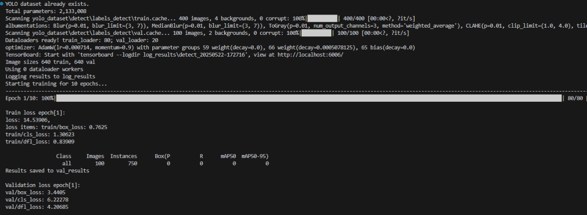
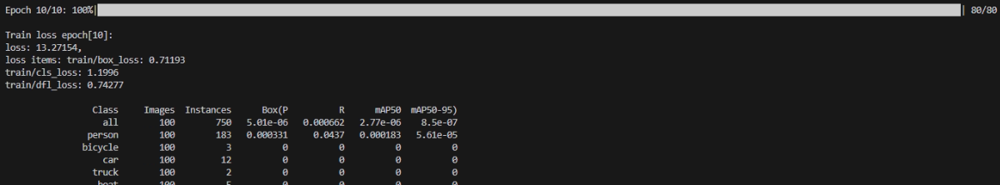
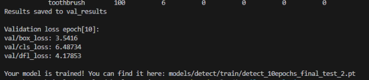
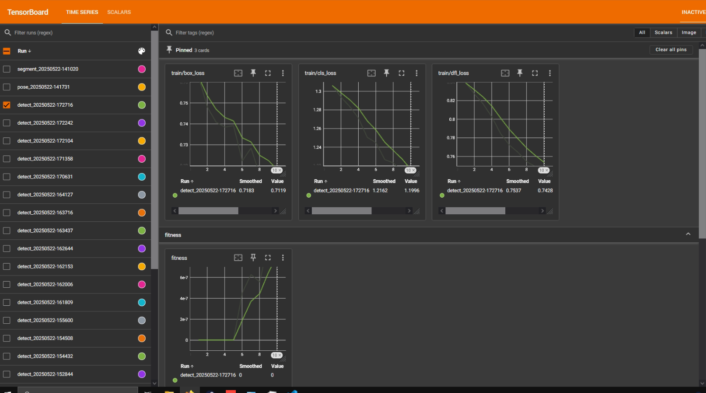

# **Custom YOLOv8-Based Object Detection, Segmentation, and Pose Estimation Framework**


## 📌 Project Overview
This repository provides a modular and extensible PyTorch-based **framework for training YOLOv8 models on detection, segmentation, and pose tasks**. It's created for educational and research purposes.


## 🚀 Features
✅ Train YOLOv8 models for:

- Object Detection

- Instance Segmentation

- Human Pose Estimation

↔️ Support for all YOLOv8 model sizes: 'n' (nano), 's' (small), 'm' (medium), 'l' (large), 'x' (extra-large)

🧩 Modular YOLOv8-style architecture with backbone, neck, and head

⚙️ Configurable via a single YAML config file

💾 Automatic dataset conversion (COCO ➡ YOLO format)

📊 Metric tracking and validation logic for each task

🔁 EMA, AMP training, learning rate warmup, cosine schedulers

📦 Flexible modular design for custom models and training logic

📉 Tensorboard support for training monitoring and Early stopping


## ⚙️ Setup
1. Clone the repository
```sh
git clone https://github.com/ElizavetaKasapen/ADIP_YOLO8.git
cd ADIP_YOLO8
```
2. Install the dependencies
Create a virtual environment and install the requirements:
```sh
python -m venv venv
source venv/bin/activate  # On Windows: venv\Scripts\activate
pip install -r requirements.txt
```

## 📦 Required Dataset
This framework expects the [COCO80 dataset](https://cocodataset.org/#download) pre-downloaded with the following structure (you can set the path to dataset in *config.yaml*):

```
coco_dataset/
└── coco_dataset_path/
    ├── annotations/
    │   ├── instances_val2017.json  # for detection and segmentation
    │   └── person_keypoints_val2017.json  # for pose estimation
    ├── images/
    │   └── val2017/  # Images folder (can also be train2017/, etc.)
```

## 🛠️ Configuration

The configuration file is defined in:
*config.yaml*

Here you can define:
- Task type (`detect`, `segment`, or `pose`)
- Model size and path
- Mode (`train` or `predict`)
- Model path - from where the model will be uploaded (must match the task). Creates a new model if not provided
- Save model path - where the model should be saved after training (by default - last checkpoint)
- Train settings (number of epochs, batch size, etc.)
- Training hyperparameters (learning rate, warmup epochs, etc.)
- Prediction settings (image source, threshold for NMS, etc.)
- Augmentation settings
- Dataset paths 

Example YAML section for dataset:

```yaml
# Transform COCO to YOLO dataset 
dataset_config:
  coco_dataset_path: "coco_dataset"
  coco_ann_path: "annotations"
  ann_paths:
    detect: "instances_val2017.json"
    segment: "instances_val2017.json"
    pose: "person_keypoints_val2017.json"
  img_dir: "images"
  out_dir: "yolo_dataset"
  max_images: 500
  train_ratio: 0.8
```

## 📁 Project Structure
```
CONFIGURATION/              # Configuration management
│   config.py               # Defines config classes
│   config_loader.py        # Loader for the YAML config
│   yolo_data_config.py     # Data config for YOLO format
DATASET/                     # Dataset preparation and transformation
│   augment.py               # Augmentation functions
│   base.py
│   coco_to_yolo.py          # COCO to YOLO converter
│   data_formatter.py
│   instances.py
│   loader.py
│   yolo_dataset.py         # YOLO-formatted dataset handling
LOSS/                        # Loss functions and target assignment
│   assigners.py
│   detect_loss.py
│   pose_loss.py
│   segment_loss.py
│   targets_loss.py
│   __init__.py
METRICS/                    # Evaluation metrics
│   base_metric.py
│   confusion_matrix.py
│   detect_metrics.py
│   iou.py
│   map.py
│   pose_metrics.py
│   segment_metrics.py
│   __init__.py
MODEL/                       # Model architecture definition
│   scale_config.json           # Defines scaling rules for 'n', 's', 'm', 'l', 'x' sizes of model
│   yolo.py                     # Builds models
│   __init__.py
├───layers                      # Model's layers
│   │   backbone.py
│   │   basic_modules.py
│   │   head.py                 # Consists of the heads for different types of tasks
│   │   neck.py
│   │   __init__.py
PREDICTOR/                       # Inference and prediction logic for each task
│   base_predictor.py
│   predict_detect.py
│   predict_pose.py
│   predict_segment.py
│   results.py
│   __init__.py
TRAINER/                        # Training pipeline
│   early_stopping.py
│   ema.py
│   preprocess_batch.py
│   train_object.py             # Main train object
│   warmup.py
│UTILS/                         # Utility functions and submodules
│   __init__.py
├───callbacks                   # Training callbacks
│   │   tensorboard_callback.py
│   │   __init__.py
├───config                      # Config loaders and constants
│   │   constants.py
│   │   load_data_config.py
│   │   yaml_utils.py
│   │   __init__.py
├───data                        # Data helpers
│   │   check.py
│   │   io_utils.py
│   │   targets.py
│   │   __init__.py
├───io                          # Input/Output management
│   │   logger.py
│   │   path_utils.py
│   │   sources.py
│   │   __init__.py
├───models                      # Model helpers
│   │   model_layers.py
│   │   __init__.py
├───plotting                    # Visualization utilities
│   │   annotator.py
│   │   colors.py
│   │   plotting.py
│   │   __init__.py
├───processing                   # Post-processing logic
│   │   geometry.py
│   │   masks.py
│   │   nms.py
│   │   __init__.py      
├───structures                   # Custom wrapper classes
│   │   simple_class.py
│   │   tensor_wrappers.py
│   │   __init__.py
├───tools                        # General utilities and schedulers
│   │   general.py
│   │   iterable_namespace.py
│   │   schedulers.py
│   │   __init__.py
VALIDATOR/                       # Validation logic for each task
│   base_validator.py
│   detect_val.py
│   pose_val.py
│   segment_val.py
│   __init__.py
config.yaml                       # Main YAML configuration file
main.py                           # Entry point for training or prediction
```

## 🚀 Usage
1. Train a Model

Set up all the necessary configurations in *config.yaml* including the mode `train` and run:
```sh
python main.py
```
This will:

- Check if YOLO-format dataset exists. If not, it converts COCO to YOLO.

- Create a new model or uploads existing one, if you set up model_path in *config.yaml*.

- Train and validate the model for the task.

- Prints the traing result and save the trained model to disk to save_model_path from *config.yaml* if provided, otherwise last checkpoint.

2. Predict with a Model
Set *mode: predict* and *predict* settings in *config.yaml*, and run:
```sh
python main.py
```
Predictions will be printed to the console and saved to the output directory.

To check your graphs with Tensorboard run:
```sh
tensorboard --logdir  <train/save_dir>
```
<train/save_dir> - variable in config.yaml

## 🔍 Output Examples

As an example, you can find the output of 1st (warmup) and 10th epochs for detect task and Tensorboard graphs.

<p float="left">
  
  1st epoch (part of warmup) of detect training process
</p>

<p float="left">
  
  
</p>
10th epoch of detect training process

<p float="left">
  
</p>
Tensorboard graphs

## 🛠️ TODO

 [ ] Support custom YAML model definitions

 [ ] Add resume training possibility 

 [ ] Add separate validation logic (right now it's a part of training)

 [ ] Add more tracking options (MLFlow, etc.)

 [ ] Analysis of which checkpoint performs best and save it to a best_models/ folder

 [ ] Support other datasets

 [ ] Support other types of model (ONNX, etc.)

 [ ] Support new version of YOLO

## 📌 Authors
- **Yelyzaveta Kasapien**: y.kasapien@student.it